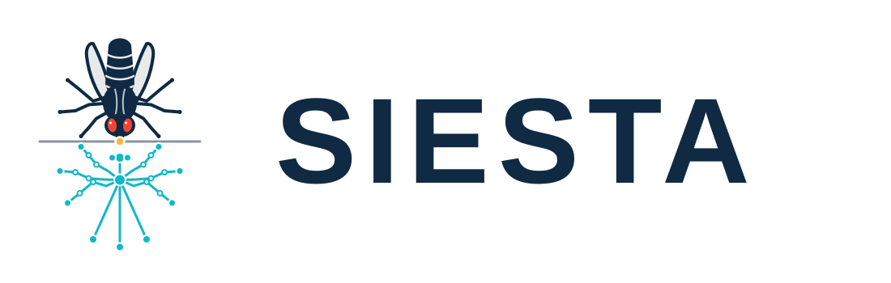

<h1 align="center">
  <picture>
    <source media="(prefers-color-scheme: dark)" srcset="docs/assets/siesta-readme-lockup-dark.svg">
    <source media="(prefers-color-scheme: light)" srcset="docs/assets/siesta-readme-lockup-light.svg">
    
  </picture>
</h1>

<p align="center"><strong>S</strong>elf-supervised <strong>I</strong>nference <strong>E</strong>ngine for <strong>S</strong>patial <strong>T</strong>racking of <strong>A</strong>nimals</p>

# SIESTA

Code, prompts, SLEAP configurations and example movies for **Learning fly pose from vision-language annotations**.

SIESTA uses vision-language-model annotations to train SLEAP pose networks without human-labeled training data. We generated the annotations with Codex vision and trained the pose models with SLEAP. The annotation and temporal-review prompts are in `prompts/`, and the SLEAP-NN training configurations for the 16-fly dataset are in `configs/`.

The Python utilities validate annotation records, split them into training and validation sets by source frame, export SLEAP training packages and calculate pose-agreement metrics.

## Supplementary movies

Example movies with predicted poses and color-coded animal identities. Both downloads are 720p.

| Movie | Dataset | Duration | Download |
| --- | --- | --- | --- |
| S1 | 10-fly, recording A | Full recording: 10 minutes | [SupplementalMovie1.mp4](movies/SupplementalMovie1.mp4) (33 MB) |
| S2 | 16-fly, first four-arena recording | First quarter: 15 minutes | [SupplementalMovie2.mp4](movies/SupplementalMovie2.mp4) (117 MB) |

## Install

```bash
python -m venv .venv
source .venv/bin/activate
python -m pip install -e ".[sleap,test]"
pytest
```

Core validation, splitting and metrics require only NumPy. SLEAP export additionally requires `sleap-io`.

## VLM record format

Annotation records use JSON Lines, one target crop per line:

```json
{"sample_id":"movie0-frame10-fly2","dataset":"example","source_group":"movie0-frame10","image_path":"crops/movie0-frame10-fly2.png","image_sha256":"<64 lowercase hex characters>","width":352,"height":352,"points":{"head":{"xy":[176,102],"state":"observed","confidence":"high"}},"provenance":{"coordinate_source":"VLM","human_or_sealed_labels_used":false,"classical_coordinate_method_used":false}}
```

`points` may contain any subset of the 13 landmarks. Coordinates are measured on the declared image canvas. The provenance fields record how the annotations were generated. Validation, splitting and training export accept VLM records; evaluation also accepts SLEAP predictions and human reference annotations.

The shared node order is:

```text
head, thorax, abdomen, wingL, wingR,
forelegL4, forelegR4, midlegL4, midlegR4,
hindlegL4, hindlegR4, eyeL, eyeR
```

## Typical workflow

```bash
# Validate coordinates, image hashes and provenance.
siesta-repro validate records.jsonl --images-root /path/to/project

# Make a deterministic split without placing one source frame in both cohorts.
siesta-repro split records.jsonl --output-dir runs/split --validation-fraction 0.1666667 --seed 20260910

# Convert the two cohorts to ordinary SLEAP user-label packages.
siesta-repro export-sleap runs/split/train.jsonl runs/train.slp --images-root /path/to/project --coordinate-scale 0.5
siesta-repro export-sleap runs/split/validation.jsonl runs/validation.slp --images-root /path/to/project --coordinate-scale 0.5

# Compare matched crop-level predictions with reference annotations.
siesta-repro evaluate predictions.jsonl reference.jsonl --output metrics.json --thresholds 2 4 8 16
```

The `0.5` scale converts coordinates from the 352-pixel annotation canvas to the native 176-pixel SLEAP crop. Train the exported packages with SLEAP-NN using the configurations in `configs/`.

## License

MIT. See `LICENSE`.
